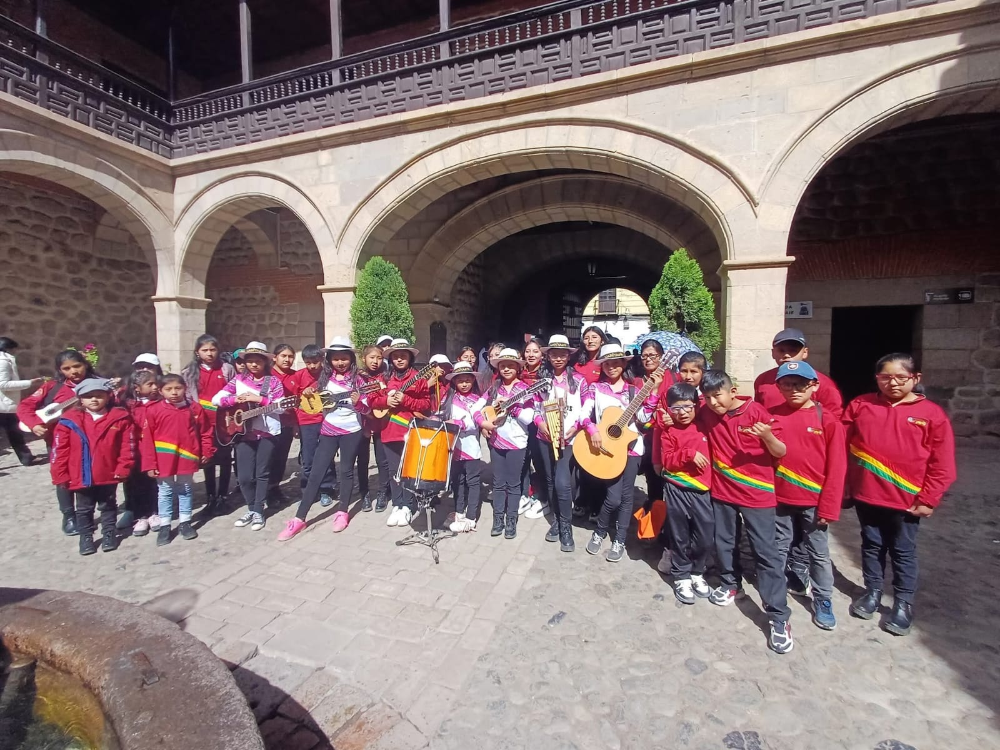
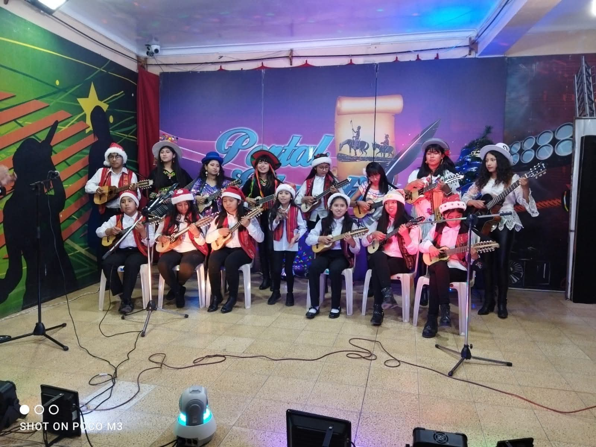
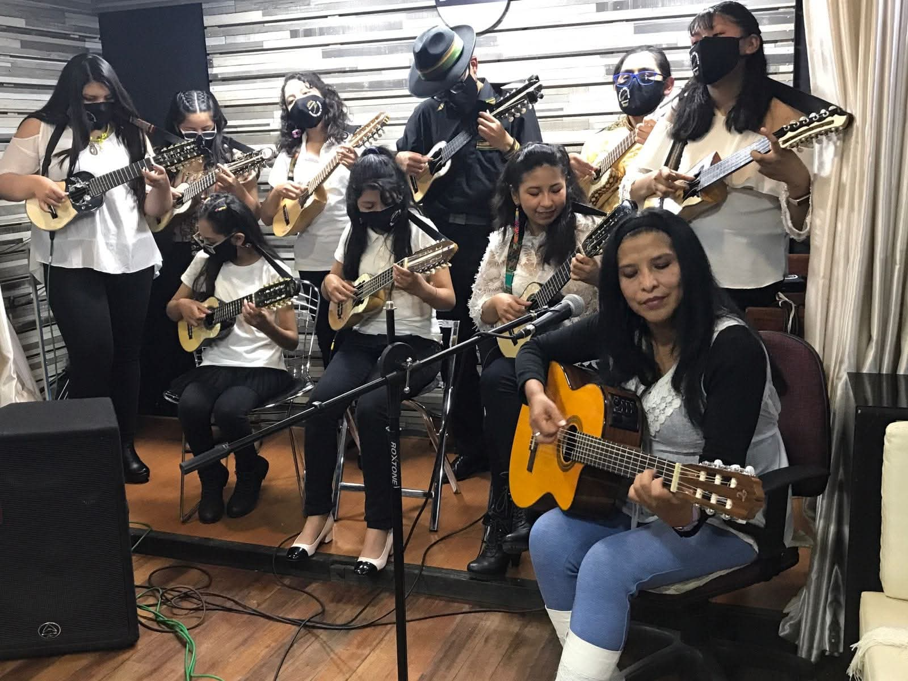
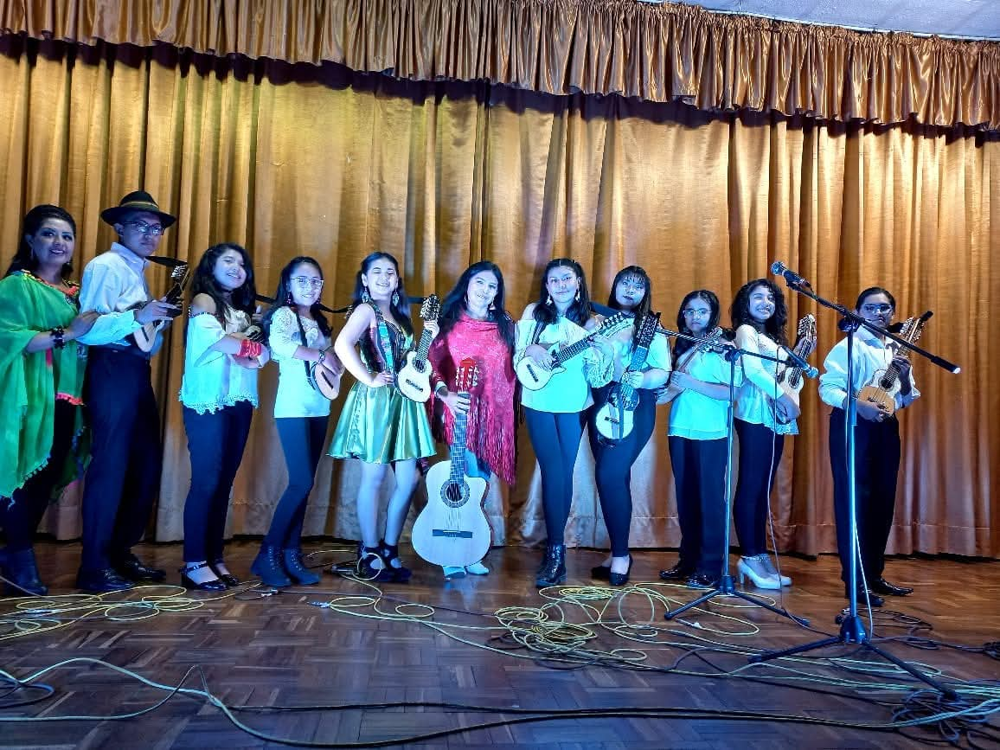

<!DOCTYPE html>
<html lang="es">
<head>
    <meta charset="UTF-8">
    <meta name="viewport" content="width=device-width, initial-scale=1.0">
    <title>Escuela de Artes Musicales Wara - Oruro</title>
<link rel="stylesheet" href="estilos.css">
    <link href="https://cdn.jsdelivr.net/npm/bootstrap@5.0.2/dist/css/bootstrap.min.css" rel="stylesheet" integrity="sha384-EVSTQN3/azprG1Anm3QDgpJLIm9Nao0Yz1ztcQTwFspd3yD65VohhpuuCOmLASjC" crossorigin="anonymous">
    <link rel="stylesheet" href="https://cdnjs.cloudflare.com/ajax/libs/font-awesome/7.0.1/css/all.min.css">
    <link href="https://fonts.googleapis.com/css2?family=Montserrat:wght@400;700&family=Playfair+Display:wght@700&display=swap" rel="stylesheet">
</head>
<body>
    <nav class="navbar navbar-expand-lg navbar-dark sticky-top">
        

            <a class="navbar-brand" href="#">
                <i class="fas fa-music me-2"></i>Escuela Wara
            </a>
            <button class="navbar-toggler" type="button" data-bs-toggle="collapse" data-bs-target="#navbarNav">
                
            </button>
            

                <ul class="navbar-nav ms-auto">
                    <li class="nav-item">
                        <a class="nav-link" href="#inicio">Inicio</a>
                    </li>
                    <li class="nav-item">
                        <a class="nav-link" href="#nosotros">Nosotros</a>
                    </li>
                    <li class="nav-item">
                        <a class="nav-link" href="#cursos">Cursos</a>
                    </li>
                    <li class="nav-item">
                        <a class="nav-link" href="#galeria">Galería</a>
                    </li>
                    <li class="nav-item">
                        <a class="nav-link" href="#testimonios">Testimonios</a>
                    </li>
                         <li class="nav-item">
                        <a class="nav-link" href="#docentes">Docentes</a>
                    </li>
                    </li>
                    <li class="nav-item">
                        <a class="nav-link" href="#contacto">Contacto</a>
                    </li>
                </ul>
            

        

    </nav>

    <section id="inicio" class="hero-section">
        

            <h1 class="display-3 fw-bold mb-4">Escuela de Artes Musicales Wara</h1>
            
Descubre el poder de la música y desarrolla tu talento artístico en nuestra escuela

            

                <a href="#cursos" class="btn btn-primary btn-lg ">Nuestros Cursos</a>
                <a href="#contacto" class="btn btn-outline-light btn-lg">Contáctanos</a>
            

        

        <i class="fas fa-music music-note note-1"></i>
        <i class="fas fa-guitar music-note note-2"></i>
    </section>

    <section id="nosotros" class="py-5 bg-light">
        

            <h2 class="text-center section-title">Sobre Nosotros</h2>
            

                

                    
                

                

                    <h1>Nuestra Historia</h1>
                    
La Escuela de Artes Musicales "Wara" es una institución educativa ubicada en la ciudad de Oruro, Bolivia, entre las calles 1ro de Noviembre y 6 de Agosto. Nos dedicamos a la formación musical de niños, jóvenes y adultos, fomentando el desarrollo artístico y cultural de nuestra comunidad.

                    
Nuestro objetivo es brindar una educación musical de calidad, accesible para todos, preservando y promoviendo las tradiciones musicales bolivianas mientras exploramos diversos géneros y estilos musicales.

                    

                        

                            

                                <i class="fas fa-check-circle text-primary me-3 mt-1"></i>
                                

                                    <h5 class="mb-0">Profesores calificados</h5>
                                    
Instructores con amplia experiencia

                                

                            

                        

                        

                            

                                <i class="fas fa-check-circle text-primary me-3 mt-1"></i>
                                

                                    <h5 class="mb-0">Método personalizado</h5>
                                    
Aprendizaje adaptado a cada alumno

                                

                            

                        

                        

                            

                                <i class="fas fa-check-circle text-primary me-3 mt-1"></i>
                                

                                    <h5 class="mb-0">Instalaciones adecuadas</h5>
                                    
Ambientes diseñados para la enseñanza

                                

                            

                        

                        

                            

                                <i class="fas fa-check-circle text-primary me-3 mt-1"></i>
                                

                                    <h5 class="mb-0">Presentaciones públicas</h5>
                                    
Oportunidades para mostrar tu talento

                                

                            

                        

                    

                

            

        

        

            

                

                    

                        <i class="fas fa-guitar"></i>
                    

                    <h4>Instrumentos Variados</h4>
                    
Aprende a tocar charango, guitarra, zampoña,y uno especial de canto y más con nuestros expertos instructores.

                

                

                    

                        <i class="fas fa-users"></i>
                    

                    <h4>Clases Grupales</h4>
                    
Disfruta del aprendizaje colaborativo en nuestras clases grupales para diferentes niveles.

                

                

                    

                        <i class="fas fa-user-graduate"></i>
                    

                    <h4>Certificación</h4>
                    
Recibe un certificado al completar satisfactoriamente cada nivel de instrucción.

                

            

        

    </section>

    <section id="cursos" class="py-5 bg-light">
        

            <h2 class="text-center section-title">Nuestros Cursos</h2>
           <h5 class="text-center mb-5 ">Ofrecemos una variedad de cursos musicales para todas las edades y niveles</h5>
    

        

            

                
                

                    <h5 class="card-title">Guitarra</h5>
                        
Aprende desde lo básico hasta técnicas avanzadas de guitarra clásica y popular.

                        <ul class="list-unstyled">
                            <li><i class="fas fa-clock text-primary me-2"></i> 2 horas semanales</li>
                            <li><i class="fas fa-calendar-alt text-primary me-2"></i> 6 meses de duración</li>
                            <li><i class="fas fa-user text-primary me-2"></i> Todos los niveles</li>
                        </ul>
                    

                        

                            <a href="#contacto" class="btn btn-primary">Contactenos</a>
                        

                    

                

                
        

            

                
                

                    <h5 class="card-title">Charango</h5>
                        
Domina el instrumento emblemático de Bolivia con técnicas tradicionales y modernas.

                        <ul class="list-unstyled">
                            <li><i class="fas fa-clock text-primary me-2"></i> 2 horas semanales</li>
                            <li><i class="fas fa-calendar-alt text-primary me-2"></i> 6 meses de duración</li>
                            <li><i class="fas fa-user text-primary me-2"></i> Todos los niveles</li>
                        </ul>
                

                

                    <a href="#contacto" class="btn btn-primary">Contactenos</a>
                

            

        

    

 
    

                

                    

                        
                        

                            <h5 class="card-title">Zampoña</h5>
                            
Desarrolla tu habilidad zampoñistica con un método progresivo y personalizado.

                            <ul class="list-unstyled">
                                <li><i class="fas fa-clock text-primary me-2"></i> 2 horas semanales</li>
                                <li><i class="fas fa-calendar-alt text-primary me-2"></i> 6 meses de duración</li>
                                <li><i class="fas fa-user text-primary me-2"></i> Todos los niveles</li>
                            </ul>
                        

                        

                            <a href="#contacto" class="btn btn-primary">Contactenos</a>
                        

                    

                

                
                

                    

                        
                        

                            <h5 class="card-title">Canto</h5>
                            
Domina los temas musicales y emblematicos de Bolivia con tecnicas de canto y personalizadas.

                            <ul class="list-unstyled">
                                <li><i class="fas fa-clock text-primary me-2"></i> 2 horas semanales</li>
                                <li><i class="fas fa-calendar-alt text-primary me-2"></i> 6 meses de duración</li>
                                <li><i class="fas fa-user text-primary me-2"></i> Todos los niveles</li>
                            </ul>
                        

                        

                            <a href="#contacto" class="btn btn-primary">Contactenos</a>
                        

                    

                

    

            

           

        <button class="btn btn-primary btn-horario" type="button" data-bs-toggle="collapse" data-bs-target="#horariosCollapse">
             Ver Horarios Disponibles
        </button>
        

            

                <h5 class="card-title">Horarios </h5>
                

                    <h6>Turno Mañana</h6>
                    
<strong>Horario:</strong> 9:00 AM - 11:00 AM

                    
<strong>Areas:</strong>Charango, Canto, Guitarra, Zampoña

                    <small class="text-muted">Lunes a Viernes</small>
                

                

                    <h6>Turno Tarde</h6>
                    
<strong>Horario:</strong> 3:30 PM - 5:30 PM

                    
<strong>Areas:</strong> Charango, Canto, Guitarra, Zampoña

                    <small class="text-muted">Lunes a Viernes</small>
                

            

        

        

    </section>

    <section id="galeria" class="py-5">
        

            <h2 class="text-center section-title">Galería</h2>
           <h5 class="text-center mb-5">Momentos especiales en nuestra escuela</h5>
            
            

                

                    
                

                

                    
                

                

                    
                

                

                    
                

                 

                    
                

                

                    
                

                 

                     <iframe  src="imagenes/video1.mp4" title="Docentes" allowfullscreen width="100%" height="440" style="border:0;" allowfullscreen="" loading="lazy" referrerpolicy="no-referrer-when-downgrade"></iframe>>
                    </iframe>
                

                

                     <iframe  src="imagenes/video.mp4" title="Docentes" allowfullscreen width="100%" height="440" style="border:0;" allowfullscreen="" loading="lazy" referrerpolicy="no-referrer-when-downgrade"></iframe>>
                    </iframe>
                

                

                     <iframe  src="imagenes/video2.mp4" title="Docentes" allowfullscreen width="100%" height="449" style="border:0;" allowfullscreen="" loading="lazy" referrerpolicy="no-referrer-when-downgrade"></iframe>>
                    </iframe>
                

            

        

    </section>

    <section id="testimonios" class="py-5 bg-light">
        

            <h2 class="text-center section-title">Testimonios</h2>
           <h5 class="text-center m-5">Lo que dicen los padres de familia sobre La Escuela De Artes Musicales Wara</h5>
            

                

                    

                        

                            

                                <i class="fas fa-quote-left text-primary"></i>
                            

                            
Mi hijo siempre fue tímido, pero desde que ingresó a la Escuela de Artes Musicales Wara lo he visto transformarse. No solo ha mejorado en la música, sino también en su seguridad y disciplina. Es un orgullo como madre ver cómo la institución impulsa a los jóvenes a crecer con talento y valores.

                            

                                
                                

                                    <h6 class="mb-0">Roxana Soto Huerta</h6>
                                    <small class="text-muted">Madre de Familia</small>
                                

                            

                        

                    

                

                
                

                    

                        

                            

                                <i class="fas fa-quote-left text-primary"></i>
                            

                            
  La Escuela de Artes Musicales Wara es un orgullo para Oruro. Gracias a sus programas, mi hijo ha tenido la oportunidad de presentarse en escenarios que jamás imaginábamos. Verlo crecer como artista y como persona es algo que valoro profundamente.  

                            

                                
                                

                                    <h6 class="mb-0">Antonio Anave</h6>
                                    <small class="text-muted">Padre de Familia</small>
                                

                            

                        

                    

                

                
                

                    

                        

                            

                                <i class="fas fa-quote-left text-primary"></i>
                            

                            
 En Escuela de Artes Musicales Wara encontré un lugar donde mi hija puede desarrollar su pasión por la música en un ambiente seguro y de calidad. Los docentes son muy dedicados y siempre apoyan a los niños para que den lo mejor de sí. Me siento muy agradecido con la escuela.

                            

                                
                                

                                    <h6 class="mb-0"> Victo Julio Zarate Anugulo</h6>
                                    <small class="text-muted">Padre de Familia</small>
                                

                            

                        

                    

                

            

        

    </section>
    

     <section id="testimoniosdelosestudiantes" class="py-5 bg-light">
        

            <h2 class="text-center section-title">Estudiantes</h2>
            <h5 class="text-center mb-5">Lo que dicen nuestros estudiantes y sus experiencias sobre La Escuela De Artes Musicales Wara</h5>
            
            

                

                    

                        

                            

                                <i class="fas fa-quote-left text-primary"></i>
                            

                            
Antes solo escuchaba música, ahora la puedo tocar. En Wara descubrí que tengo talento para la guitarra y cada día aprendo algo nuevo. Me siento feliz porque aquí me apoyan y me animan a seguir creciendo. 

                            

                                
                                

                                    <h6 class="mb-0">Rodrigo Huerta</h6>
                                    <small class="text-muted">Estudiante Basico</small>
                                

                            

                        

                    

                

                
                

                    

                        

                            

                                <i class="fas fa-quote-left text-primary"></i>
                            

                            
 Lo que más me gusta es que en la escuela no solo tocamos instrumentos, también hacemos presentaciones y aprendemos a trabajar en equipo. Cada ensayo se siente como una aventura.  

                            

                                
                                

                                    <h6 class="mb-0">Carla Anugulo</h6>
                                    <small class="text-muted"> Estudiante basico</small>
                                

                            

                        

                    

                

                
                

                    

                        

                            

                                <i class="fas fa-quote-left text-primary"></i>
                            

                            
 Desde que entré a Wara, la música se volvió parte de mi vida. Los profes son muy pacientes y me ayudan a mejorar paso a paso. Ahora sueño con ser músico profesional. 

                            

                                
                                

                                    <h6 class="mb-0">Santigo Anave</h6>
                                    <small class="text-muted">Estudiante Basico</small>
                                

                            

                        

                    

                

            

        

    </section>

    <section id="docentes" class="py-5 bg-light">
        

            <h2 class="text-center section-title">Docentes</h2>
            <h5 class="text-center mb-5">Docentes especializados en los siguientes areas musicales</h5>
            

                

                    

                        

                            

                                <i class="fas fa-quote-left text-primary"></i>
                            

                            
 En cada clase busco que mis estudiantes sientan la música, no solo como una técnica, sino como una forma de expresión. Me gusta enseñar de manera dinámica, mezclando juegos vocales, práctica instrumental y repertorios que conecten con nuestra identidad cultural. Para mí, lo más importante es que los jóvenes disfruten aprendiendo y se animen a mostrar su talento sin miedo.

                            

                                
                                

                                    <h6 class="mb-0">  Rosario Peredo López </h6>
                                    <small class="text-muted">  Lincenciada Especializa En El Area De Charango, Zampoña y Canto</small>
                                

                            

                        

                    

                

                
                

                    

                        

                            

                                <i class="fas fa-quote-left text-primary"></i>
                            

                            
 Mi objetivo es que cada estudiante descubra su propio sonido. En mis clases combino la disciplina de la técnica con ejercicios prácticos que hacen más ameno el aprendizaje. Me gusta crear un ambiente de confianza donde los chicos se animen a preguntar, equivocarse y mejorar. Creo que la guitarra no solo es un instrumento, sino un puente para expresar emociones y crecer como persona.  

                            

                                
                                

                                    <h6 class="mb-0"> Abel Hurtado Barrancos</h6>
                                    <small class="text-muted"> Docente Avanzado Especializado En El Area De Guitarra</small>
                                

                            

                        

                    

                

            

        

    </section>

    <section id="contacto" class="py-5">
        

            <h2 class="text-center section-title">Contacto</h2>
            <h5 class="text-center">¡Contáctanos para más información!</h5>
            
            

                

                    <h4>Información de contacto</h4>
                    

                        

                            <i class="fas fa-map-marker-alt text-primary me-3"></i>
                            

                                <h5 class="mb-0">Dirección</h5>
                                
1ro de Noviembre, 6 de agosto y Bacovic Nª169-B, Oruro, Bolivia

                            

                        

                        

                            <i class="fas fa-phone-alt text-primary me-3"></i>
                            

                                <h5 class="mb-0">Teléfono</h5>
                                
+591 71858722

                            

                        

                        

                            <i class="fas fa-envelope text-primary me-3"></i>
                            

                                <h5 class="mb-0">Email</h5>
                                
charitocharango@gmail.com

                            

                        

                        

                            <i class="fas fa-clock text-primary me-3"></i>
                            

                                <h5 class="mb-0">Horario de atención</h5>
                                
Lunes a Viernes: 9:00 - 12:00 y 14:00 - 18:00

                                
Sábados: 9:00 - 12:00

                            

                        

                    

                

                
                

                    

                        

                            

                                <iframe src="https://forms.gle/2q2BKT6ta16t17MbA" width="100%" height="500" frameborder="0" marginheight="0" marginwidth="0"> Cargando…
                                </iframe>
                            

                        

                    

                

            

        

    
    </section>
        

            <iframe src="https://www.google.com/maps/embed?pb=!4v1759211185414!6m8!1m7!1sbn6_YlsS-9b35DtnJOSVew!2m2!1d-17.96476389120271!2d-67.10617411903087!3f15.643760188774195!4f11.373878003282897!5f0.7820865974627469" width="100%" height="450" style="border:0;" allowfullscreen="" loading="lazy" referrerpolicy="no-referrer-when-downgrade"></iframe>
        

    <footer class="footer">
        

            

                

                    <h5 class="text-white mb-4">
                        <i class="fas fa-music me-2"></i>Escuela Wara
                    </h5>
                    
Formando músicos talentosos y promoviendo nuestra cultura musical desde 1995.

                

                

                    <h5 class="text-white mb-4">Enlaces rápidos</h5>
                    <ul class="list-unstyled">
                        <li class="mb-2"><a href="#inicio" class="text-white-50">Inicio</a></li>
                        <li class="mb-2"><a href="#nosotros" class="text-white-50">Nosotros</a></li>
                        <li class="mb-2"><a href="#cursos" class="text-white-50">Cursos</a></li>
                        <li class="mb-2"><a href="#galeria" class="text-white-50">Galería</a></li>
                         <li class="mb-2"><a href="#testimonios" class="text-white-50">Testimonios</a></li>
                        <li class="mb-2"><a href="#docentes" class="text-white-50">Docentes</a></li>
                         <li class="mb-2"><a href="#contacto" class="text-white-50">Contacto</a></li>
                    </ul>
                

                

                    <h5 class="text-white mb-4">¡Contactanos!</h5>
                    
Contactanos para recibir información sobre nuestros cursos y eventos.

                    
                    <h5>¡Siguenos En Nuestras Redes Sociales!</h5>
                    

                        <a href="https://www.facebook.com/people/Escuela-De-Artes-Musicales-Wara/100063487452488/" class="social-icon"><i class="fab fa-facebook-f"></i></a>
                        <a href="https://www.instagram.com/waraoficial.bo?igsh=MWFhMmx1dzlyZzlvaA==" class="social-icon"><i class="fab fa-instagram"></i></a>
                        <a href="https://www.youtube.com/channel/UCQjrRrXDgJpdJbIQfakpx9w" class="social-icon"><i class="fab fa-youtube"></i></a>
                        <a href="https://www.tiktok.com/@warabolivia?_t=ZM-8yokVvjGK7K&_r=1" class="social-icon"><i class="fab fa-tiktok"></i></a>
                    

                

            

            

            

                

                    
&copy; 2025 Escuela de Artes Musicales Wara. diseñado por Marco Antonio Velasquez Zubieta, Ismael Rodrigo Conde.

                

            

        

    </footer>

    
    
</body>
</html>
